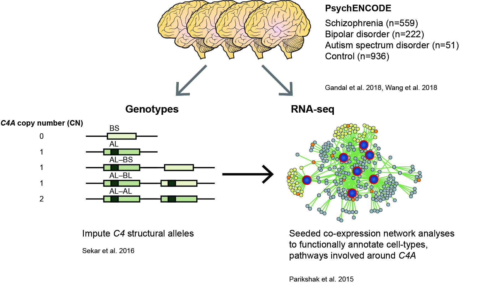

Code repository associated with:

**Brain gene co-expression networks link complement signaling with convergent synaptic pathology in schizophrenia**  
Minsoo Kim, Jillian R. Haney, Pan Zhang, Leanna M. Hernandez, Lee-kai Wang, Laura Perez-Cano, Loes M. Olde Loohuis, Luis de la Torre-Ubieta, Michael J. Gandal    
**doi:** https://doi.org/10.1038/s41593-021-00847-z

Contact: mmkim1210@gmail.com

 

**Analysis overview:** 

